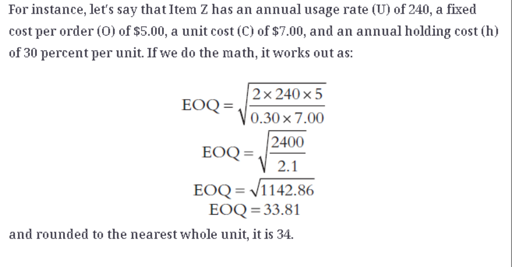

# EOQ-Assignment-Supply-Chain
Example formula for EOQ for Supply Chain Class

## To Run

Clone your repo to your desktop. Inside, modify the values to what you would like them to be. 

Defaults:

With Node:

Run `node ./app.js`
